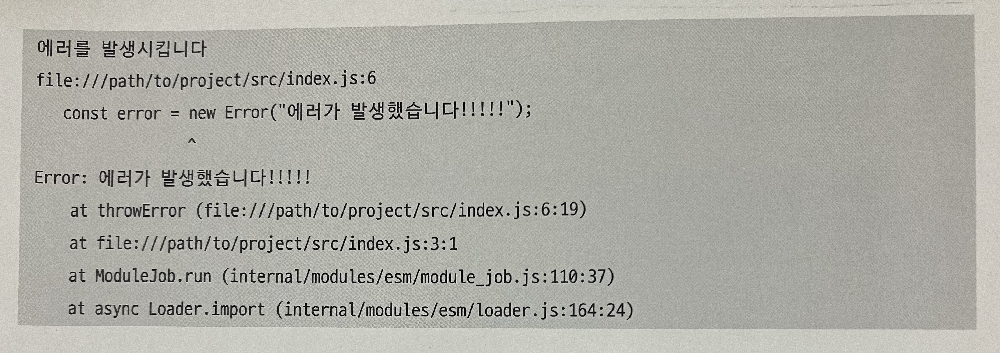
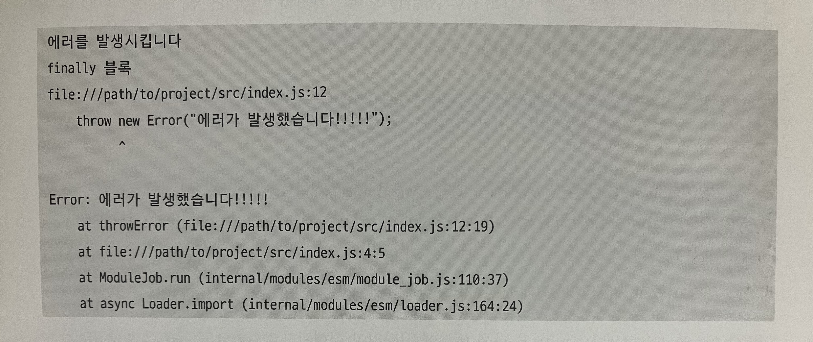

# 5. 타입스크립트의 클래스

- [5. 타입스크립트의 클래스](#5-타입스크립트의-클래스)
  - [5.5 예외 처리](#55-예외-처리)
    - [5.5.1 throw 문과 Error 객체](#551-throw-문과-error-객체)
    - [5.5.2 예외를 캐치하는 try-catch 문](#552-예외를-캐치하는-try-catch-문)
    - [5.5.3 예외 처리와 전역 탈출](#553-예외-처리와-전역-탈출)
    - [5.5.4 finally로 탈출에 끼어들기](#554-finally로-탈출에-끼어들기)
  - [5.6 테스트](#56-테스트)
    - [5.6.1 클래스로 바꿔보기](#561-클래스로-바꿔보기)
    - [5.6.2 해설](#562-해설)
    - [5.6.3 클래스를 함수로 바꿔보기](#563-클래스를-함수로-바꿔보기)
    - [5.6.4 해설](#564-해설)

## 5.5 예외 처리

여기서 예외란 런타임 에러를 말한다. 타입스크립트에서는 프로그램상의 실수 대부분을 컴파일 에러로 검출해 주지만, 컴파일 시에 검출할 수 없는 실수 또한 많다. 그리고 외부와 데이터를 주고받는 프로그램의 경우에도 외적 요인으로 인한 실패를 피할 수 없다.

타입스크립트에는 이와 같은 런타임 에러를 다루기 위한 구문과 내장 객체가 마련되어 있다.

### 5.5.1 throw 문과 Error 객체

런타임 에러를 발생시키는 방법과 런타임 에러가 발생했을 때의 프로그램 동작에 대해 알아보도록 하자!

- 에러를 발생시키고 싶을 때
  에러를 나타내는 객체인 `Error 인스턴스` 를 준비한다. `new Error()` 로 만든다.

<br/>

- 에러를 발생시킬 때

`throw 문` 을 사용한다. `throw 식;` 형태이고 식 부분에 Error 객체를 지정한다. 그리고 이 throw 문이 실행된 시점에서 에러가 발생한다.

```ts
console.log("에러를 발생시킵니다");
throwError();
console.log("에러를 발생시켰습니다");

function throwError() {
  const error = new Error("에러가 발생했습니다!!!!!");
  throw error;
}
```

이 프로그램을 실행하면 다음과 같은 결과를 볼 수 있다.



첫 줄을 제외한 모든 것은 `throw error;` 로 발생한 런타임 에러에서 출력된 것이다.

에러가 발생했을 때 출력에 포함되는 주된 정보는 1. 에러메시지 와 2. 에러가 어디에서 발생했는가이다.
`const error = ...` 에서 확인할 수 있으며 어디에서 만들어진 Error 객체가 예외로 던져졌는지 명시되어 있다.

출력의 마지막 5행은 에러메시지와 **스택 트레이스**이다. 스택 트레이스란 에러가 발생하기 전까지 프로그램이 어떠한 과정을 거쳐 실행됐는지에 대한 정보이다. 가장 위에 `at throwError` 를 보면 `throwError` 함수 안에서 에러가 발생했다는 것을 알 수 있다. 함수명뿐만 아니라 그 함수가 속한 파일명의 정보도 포함된다.

`console.log("에러를 발생시켰습니다");` 문이 실행되지 않았다. 그 이유는 에러가 발생했을 때 프로그램의 실행이 그곳에서 중단되기 때문이다.

문제가 생겨서 더 이상 실행을 계속할 수 없게 되면 `throw 문`으로 에러를 발생시키는 것이 전형적인 패턴이다.

```ts
function getAverage(nums: number[]) {
  if (nums.length === 0) {
    throw new Error("배열이 비어 있습니다");
  }
  return sum(nums) / nums.length;
}
```

`getAverage` 는 `number[]` 타입의 배열을 받아 평균값을 반환하는 함수인데, 빈 배열이 주어지면 에러를 발생시킨다.
주어진 배열 `nums` 가 비어 있을 (length가 0) 경우에는 `throw 문`이 실행되어 프로그램이 중단되고, 그 외의 경우에는 반환값으로 `sum(nums) / nums.length` 를 계산해서 반환한다.

에러가 발생하면 무조건 프로그램이 종료되는데, 프로그램이 강제 종료되는 현상을 부르는 크래시가 발생하면 좋지 않은 경우가 많으므로, 에러가 발생하더라고 프로그램을 계속 실행시키기 위한 수단을 알아보도록 하자.

### 5.5.2 예외를 캐치하는 try-catch 문

```ts
try {
  // try 블록 (여기에 여러 개의 문을 넣을 수 있다)
} catch (err) {
  // catch 블록 (여기에도 여러 개의 문을 넣을 수 있다)
}
```

try catch 문의 기본적인 구문 형태이다.

사용된 두 번의 `{ }` 는 모두 블록이다. `try catch 문`에서는 반드시 블록을 사용해야 한다. `catch (err)` 부분의 `err` 는 변수명이다. `catch 블록`에 전달되는 인수와 같은 것인데, `catch 블록`의 안에서만 사용할 수 있다.

먼저 `try 블록` 안의 코드를 실행하고, `try 블록` 안에서 예외가 발생하면 `catch 블록`을 실행한다.

이 때 `try 블록` 내부의 실행이 중단되고, 예외가 발생한 시점에서 프로그램이 강제 종료되는 것을 막고 바로 `catch 블록`으로 옮겨간다. `catch 블록`이 실행될 때 선언된 변수 `err` 에는 `throw 문`에서 던져진 `Error 객체`가 담긴다. 그 뒤에 `try catch 문`의 다음부터 이어서 프로그램을 실행한다.

try 블록에서 예외가 발생하지 않을 경우 catch 블록은 실행되지 않고 `try catch 문`의 다음으로 나아간다.

```ts
try {
  console.log("에러를 발생시킵니다");
  throwError();
  console.log("에러를 발생시켰습니다");
} catch (err) {
  console.log("에러를 캐치했습니다");
  console.log(err);
}
console.log("끝");

function throwError() {
  const error = new Error("에러가 발생했습니다!!!!!");
  throw error;
}
```


<details>
<summary>
출력되는 메시지를 예상해보아요!
</summary>


</details>

### 5.5.3 예외 처리와 전역 탈출

 try catch 문은 강력한 언어 기능이지만, 그만큼 취급에 주의가 필요하다.


```ts
try {
  someFunc();
} catch (err) {
  // 아무것도 하지 않는다
}
```

위와 같이 someFunc 내에서 에러가 발생해도 무시하는 프로그램을 만들 수 있다.

```ts
try {
  someFunc();
} catch {
  // 아무것도 하지 않는다
}
```

catch 에서 선언한 변수를 catch 블록 내에서 사용하지 않을 경우, 위 코드와 같이 변수 선언을 생략해서 사용할 수 있다.

캐치된 에러의 내용을 참고하지 않거나 에러 처리를 하지 않고 넘어가는 것은 나쁜 예외 처리의 전형이다.

try catch 문과 throw 문이 세트로 쓰이는 경우도 많다.
throw 문으로 에러를 발생시키는 프로그램에서 실패 처리를 하기 위해서 try catch 문이 꼭 필요하게 된다.

throw 이외에 실패를 표현하는 수단으로는 **실패를 표현하는 값을 반환** 할 수 있다.

```ts
function getAverage(nums: number[]) {
  if (nums.length === 0) {
    return undefined;
  }
  return sum(nums) / nums.length;
}
```

위처럼 `getAverage` 의 실패 여부를 판정하려면 반환값이 `undefined` 와 일치하는지 알아보면 된다.

처리 실패를 표현하는 방법은 주로
1. 예외를 사용 하는 방법과
2. 실패를 표현하는 반환값을 사용하는 방법으로 나뉜다.

타입 정보 측면에서는 2번이 더 우수하다.

- `err` 의 변수 타입은 unknown 이 나온다. 이는 어떤 값이 들어갈지 완전히 불명이라는 의미이다. 어떤 값인지 전혀 알 수 없다면 catch 로 에러를 잡는다 하더라도 처리가 불편해진다.

하지만 예외와 try catch 문을 사용하는 것이 바람직한 경우도 있는데, 예외가 지닌 **전역탈출** 이라는 특징을 활용하는 경우이다.

전역 탈출이란?
: 그 자리에서 실행을 중단하고 프로그램의 제어를 다른 곳으로 옮기는 것

throw 문으로 에러가 발생했을 때, 다음 코드는 실행되지 않는다.

실행된 단계에서 함수 실행이 종료되고 함수의 바깥으로 제어가 넘어가는 것을 보아 return 문도 전역 탈출의 동료로 간주할 수도 있다.

```ts
try {
  throwError();
  // try 블록에서 탈출하므로 여기는 실행되지 않는다
  console.log("これ는表示されない");
} catch (err) {
  console.log(err);
}

function throwError() {
  const error = new Error("에러가 발생했습니다!!!!!");
  throw error;
  // 함수에서 탈출하므로 여기는 실행되지 않는다
  console.log("이 문장도 출력되지 않는다");
}
```

`throwError` 내의 `throw 문`이 예외를 발생시키는데, 이 시점에서 예외는 함수 `throwError` 에서 탈출한다. 그러므로 `throw error;` 보다 뒤에 있는 문은 실행되지 않는다.
`throwError();` 라는 함수 호출은 `try 블록` 안에서 실행됐지만 함수를 벗어난 예외는 탈출을 멈추지 않고 이 블록도 탈출한다. `throwError();` 다음의 `console.log` 도 실행되지 않는다.
블록을 탈출하면 `try catch 문`을 만나게 되므로 여기에서 예외가 캐치된다.

예외가 전역 탈출을 발생시키는 것에는 **여러 곳에서 발생한 에외를 한 곳에서 처리할 수 있다**는 장점이 있다. try catch 문으로 코드를 감싸 두면 그 안에서 발생한 모든 에외를 해당 try catch 문으로 처리할 수 있다. = 예외 발생할 가능성이 있는 경우, 모아서 처리 가능

throw 문으로 예외를 처리하는 경우에는 전역 탈출이 강제된다는 의미이기도 한다. 실패해도 처리를 계속하고 싶다면 그곳에 try catch 문을 배치하고 전용 에러 처리를 넣어야한다. 하지만 여러개의 try catch 문을 사용하면 프로그램을 이해하기 어려워진다. 경우에 따라 에러 처리가 달라져야 한다면 반환값으로 에러를 제어하는 편이 나을 수 있다.

=> 
예외에는 전역 탈출이라는 특징이 있어서 에러가 발생하면 일단 처리를 중단하고 공통적으로 에러 처리를 하고 싶을 경우 유리하다.

```ts
try {
  const bigInt = BigInt("foobar"); // 여기서 에러 발생
  // 따라서 아래의 console.log는 실행되지 않는다
  console.log(bigInt);
} catch(error) {
  // SyntaxError: Cannot convert foobar to a BigInt가 출력된다(Node.js의 경우)
  console.log(error);
}
```

단, `throw 문`을 전혀 사용하지 않더라고 여전히 `try catch 문`을 통한 에러 처리가 필요한 경우도 있다. 문자열을 `BigInt` 로 변환할 경우 정수로 해석할 수 없는 문자열이 `BigInt` 함수에 주어지면 런타임 에러가 발생하게 된다.

<br/>

### 5.5.4 finally로 탈출에 끼어들기

`try catch 문`의 뒤에는 `finally { ... }` 형태의 `fianlly 블록`을 추가로 사용할 수 있다.
`catch 블록`을 생략해서 `try finally` 형태로도 만들 수 있다.

```ts
// try-catch-finally 예시
try {
  console.log("try 블록")
} catch (err) {
  console.log("catch 블록")
} finally {
  console.log("finally 블록")
}

// try-finally 예시
try {
  console.log("try 블록")
} finally {
  console.log("finally 블록")
}
```

`finally 블록`의 본문은 에러 발생 여부에 상관없이 실행된다. `try 블록`을 실행해도 에러가 발생하지 않으면 다음으로 `finally 블록`이 실행되고, `try 문`의 처리도 같이 종료된다.

반면에 `try 블록` 실행 중에 에러가 발생했다면 `try 블록`의 실행은 중단되고 `catch 블록`이 실행되며, 그 뒤에 `finally 블록`이 실행된다.

<details>
<summary>
위 코드를 실행했을 때 출력되는 메시지를 예상해보아요!
</summary>
try 블록 <br/>
finally 블록
</details>

<br/>

에러가 발생했을 경우의 예시도 살펴보자!

```ts
try {
  console.log("try 블록 1")
  throwError();
  console.log("try 블록 2")
} catch (err) {
  console.log("catch 블록")
} finally {
  console.log("finally 블록")
}
```
<details>
<summary>
위 코드를 실행했을 때 출력되는 메시지를 예상해보아요!
</summary>
try 블록 1<br/>
catch 블록 <br/>
finally 블록
</details>

<br/>

이 결과들을 보고 굳이 fianlly 블록에 넣지 않고 try catch 문의 뒤에 넣어도 되지 않나? 하는 의문이 들었을 수도 있다. 실제로도 이 생각이 맞으며 대부분의 경우 finally 블록은 필요하지 않다.

하지만 **탈출에 끼어드는 것**은 `fianlly` 로만 할 수 있는 것이다.
`try 문`에서 탈출하더라도 `finally 블록`은 반드시 실행된다.

애초에 `catch 블록`이 없는 형태로는 `try 블록` 안에서 발생한 에러가 캐치되지 않는다. 내부에서 발생한 에러는 전역 탈출이 일어날 때 `try` 를 지나쳐서 더 위로 탈출하게 된다. `try 문`에서 탈출할 때 끼어들어 `finally 블록`이 실행되는 것이다.

```ts
try {
  console.log("에러를 발생시킵니다");
  throwError();
  console.log("에러를 발생시켰습니다");
} finally {
  console.log("finally 블록");
}
console.log("try 문의 뒤");

function throwError() {
  throw new Error("에러가 발생했습니다!!!!!");
}
```



위의 예시 코드를 실행할 때 나타나는 결과값이다.

`try 블록`이 실행되고 `throwError();` 에서 에러가 발생했다.
c`atch 블록`이 없으므로 이 에러는 `try 블록` 바깥으로 탈출하면서 `finally 블록` 메세지가 출력되었다. 이 출력은 에러가 try 문에서 탈출할 때 finally 블록이 실행되었음을 나타낸다.

에러는 `finally 블록` 실행이 끝나면 다시 탈출한다. 그리고 `try 문` 바깥으로 탈출한 에러가 프로그램 크래시를 일으켰다.

<br/>

`finally` 는 에러 이외의 탈출에도 대응한다. `return 문`은 함수로부터의 탈출로 간주할 수 있는데, 여기에도 `finally` 블록이 끼어들 수 있다.

```ts
console.log(sum(100));

function sum(max: number): number {
  try {
    let result = 0;
    for (let i = 1; i <= max; i++) {
      result += i;
    }
    return result;
  } finally {
    console.log("sum에서 탈출합니다!!!!");
  }
}
```
간단한 함수 `sum` 의 본문이 `try finally 문`으로 감싸져 있다.


`finally 블록`에 의해 출력된 메세지를 확인할 수 있다.
이 메시지는 `sum` 안의 `return result;` 문에 의해 `try 블록`에서 탈출이 일어났지만, `finally 블록`이 거기에 끼어들어 메시지를 출력했음을 의미한다.

그리고 그 뒤에 탈출이 재개되어 `sum` 의 반환값으로서 `5050` 이 출력된 것을 볼 수 있다.

이러한 예시를 보면 `finally` 는 무조건 실행된다는 쪽이 맞을지도 모른다. 파일을 열었다면 파일을 사용한 뒤에 반드시 닫아야한다. 파일을 염과 동시에 `try 블록`에 진입하고 `finally 블록`에서 파일을 닫는 처리를 하면 에러 발생이나 `return` 에 의한 중도 탈출 등 어떠한 경우에도 확실히 파일을 닫을 수 있게 된다.


## 5.6 테스트

### 5.6.1 클래스로 바꿔보기

### 5.6.2 해설

### 5.6.3 클래스를 함수로 바꿔보기

### 5.6.4 해설
